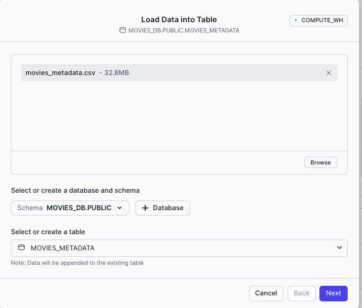
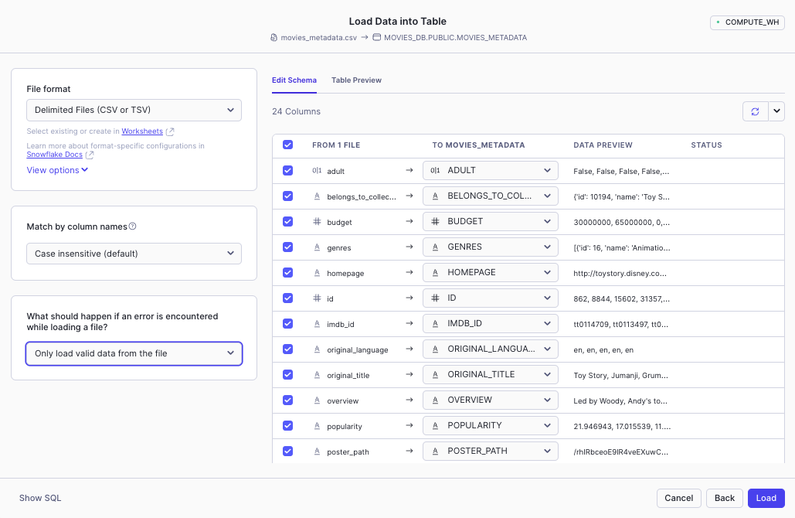
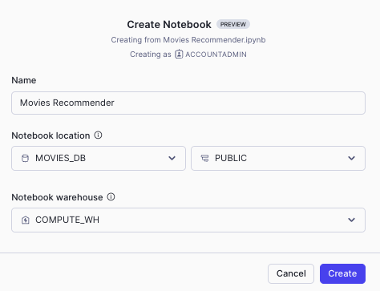
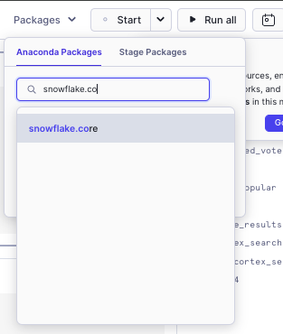
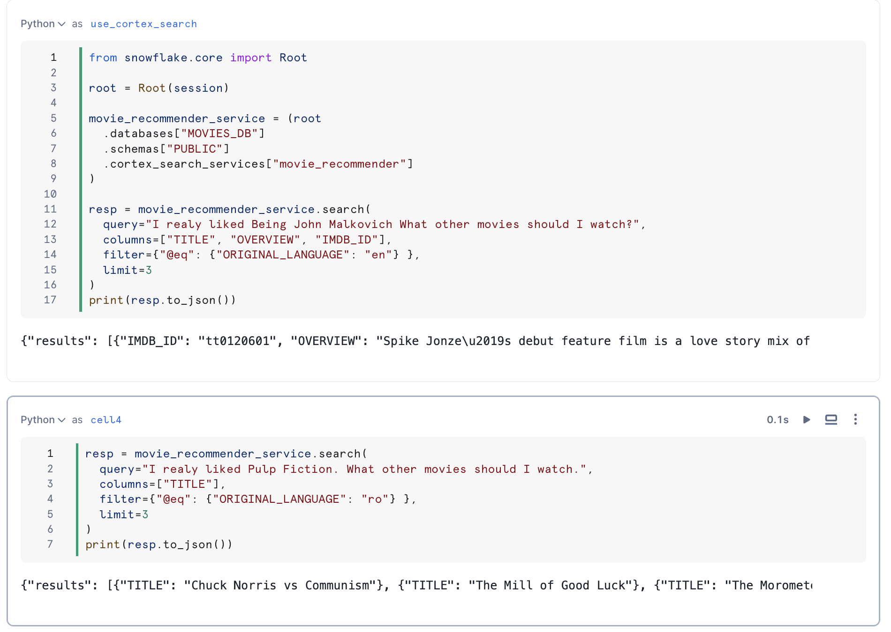

## Steps:
1. Run <code>setup.sql</code>
2. Load data into <code>MOVIES_METADATA</code> from <code>movies_metadata.csv</code> file. Select Only load valid data from the file.

3. Create Notebook -> Import <code>2-rag-movie-recommender-logging-feedback/Movies Recommender.ipynb</code> file

4. Add the <code>snowflake.core</code> package

5. Run All cells

6. Create the SiS app: The Streamlit app comes with a default template you can delete and replace with the code from the <code>2-rag-movie-recommender-logging-feedback/movie-recommender-sis.py </code>
