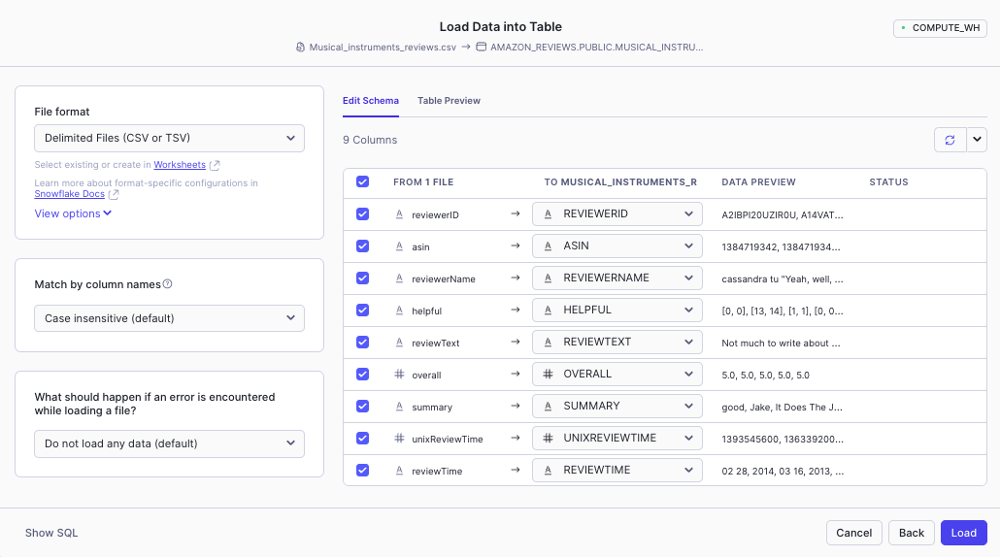
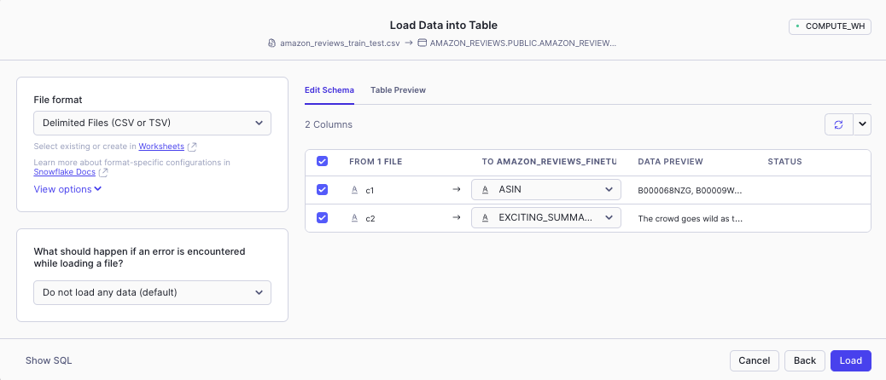
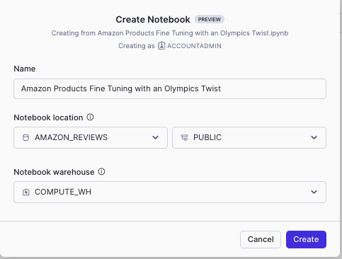
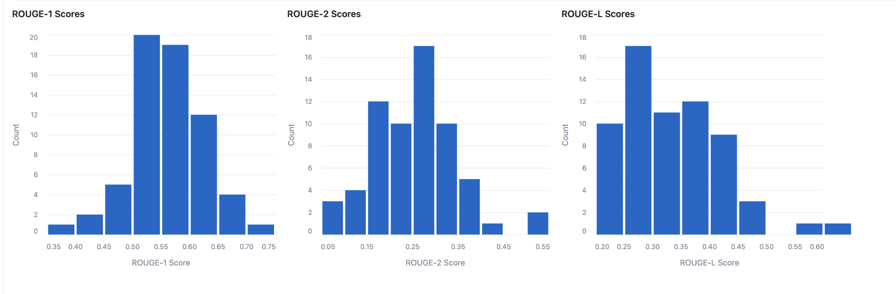

## Steps:
1. Run <code>setup.sql</code>
2. Load data into <code>amazon_reviews</code> from <code>Musical_instruments_reviews.csv</code> file. Select Only load valid data from the file.

3. Load data into <code>AMAZON_REVIEWS_FINETUNE</code> from <code>amazon_reviews_train_test.csv</code> file. Select Only load valid data from the file.

4. Create Notebook -> Import <code>3-fine-tuning-customer-says-tone-olympics/Amazon Products Fine Tuning with an Olympics Twist.ipynb</code> file

5. Add the <code>rouge-score</code> package

6. Run All cells, and do not forget to update the <code>CortexFineTuningWorkflow_id</code> 

