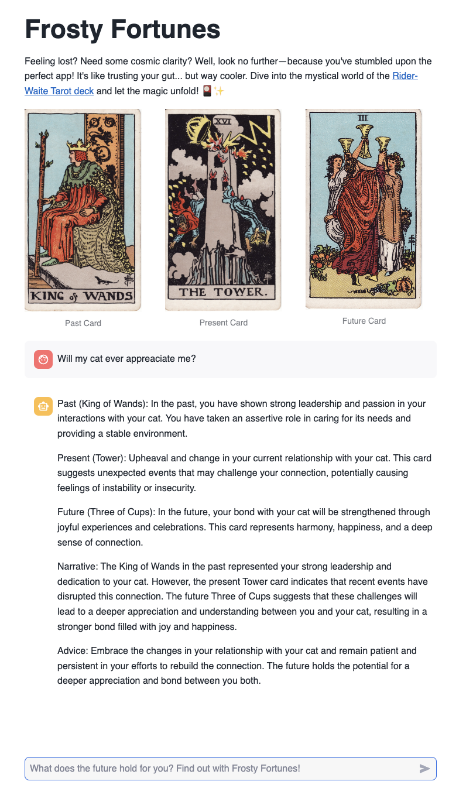
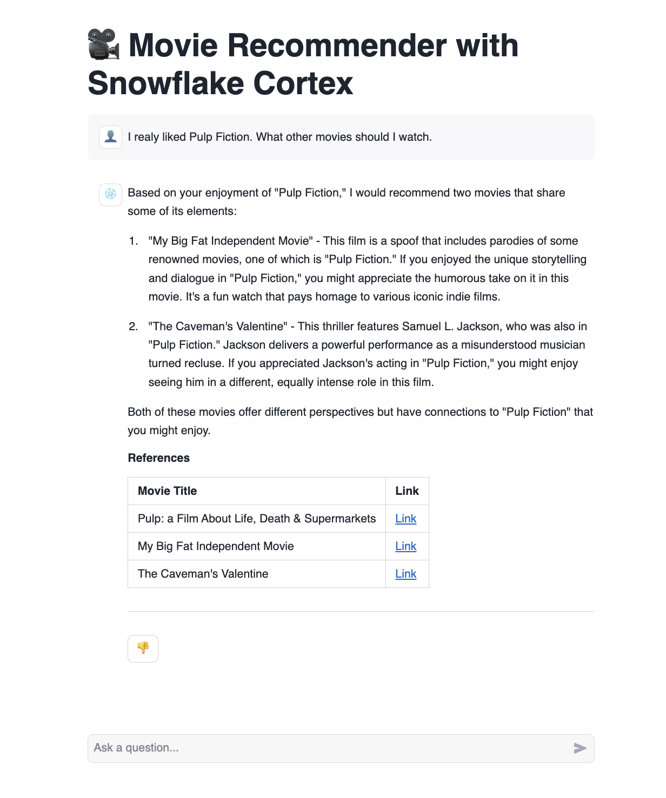
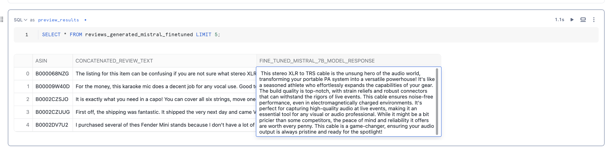

## 🃏 Frosty Fortunes (Tarot AI) - Prompt Engineering

-  *Description*: This demo showcases a LLM-powered (mistral-7b) tarot card reading application. The app is designed to offer cosmic guidance and clarity, simulating the experience of consulting a real tarot reader. 
- *Business value*: The global tarot cards market is expanding robustly. It was valued at USD 1.292 billion in 2023 and is projected to reach USD 1.589 billion by 2030, growing at a CAGR of 3.51%
- *Key Features*: Personalized readings, private cosmic guidance
- *Why Snowflake*: secure storage for tarot card images (trusted), one platform (efficient), rapid prototyping (easy)

## 🎥 Movie Recommender - RAG with Logging and Feedback 

- *Description*: This demo highlights a movie recommender system that leverages LLMs to provide personalized movie recommendations. 
- *Business value*: Increasing revenue, enhancing user engagement, improving customer experience, providing valuable insights, and offering a competitive advantage.
- *Key Features*: Minimal hallucinated movie names and recommendations based on provided context and language. Includes sources and links to the movies and feedback button
- *Why Snowflake*: Cortex Search (easy, efficient), secure and reliable environment for storing and processing your movie data (trusted). 

## ⭐ Customers Say with an Olympic Games commentator tone - Serverless Fine tuning and Scoring (evaluation with Rouge Score)

- *Description*: Generating summaries with an Olympics twist. It is part of Amazon's strategy to maintain a customer-centric approach by building trust and driving continuous improvement based on real user feedback.
- *Business Value*: "Customers Say" feature is a crucial component of Amazon's strategy to maintain a customer-centric approach, build trust, and drive continuous improvement based on real user feedback.
- *Key Features*: LLM-generated summaries and insights into product quality and entertainment value.
- *Why Snowflake*: Serverless Fine-tuning (efficient, easy), secure and reliable environment for storing and processing product review data (trusted), Model Registry integration (model versioning and management), generated summary evaluation (rouge score, Anaconda Snowflake channel)

